# AWS VPC Endpoint for Amazon S3

## 📖 Project Overview

In this hands-on AWS networking project, I configured secure private connectivity between an Amazon EC2 instance and an Amazon S3 bucket using a **Gateway VPC Endpoint**.

The objective was to understand how Amazon S3 traffic can remain within the AWS private network instead of traversing the public internet.

During the implementation, I also encountered an **AccessDenied** error after applying an S3 bucket policy. I investigated the issue, identified a missing VPC Endpoint route table association, corrected the routing configuration, and successfully restored secure access to the S3 bucket.

---

## 🏗️ Architecture

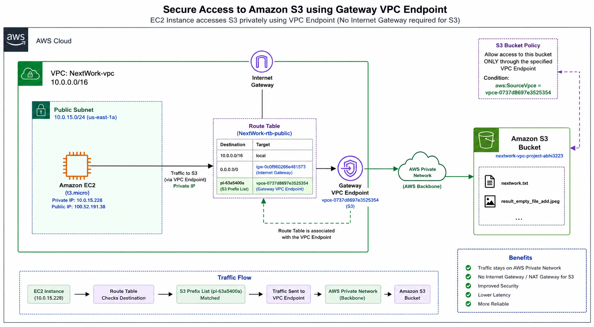

---

## ☁️ AWS Services Used

- Amazon VPC
- Public Subnet
- Route Table
- Internet Gateway
- Security Group
- Amazon EC2
- Amazon S3
- Gateway VPC Endpoint
- IAM
- AWS CLI

---
## 🚀 Project Implementation

### Step 1 - Create a Custom VPC

Created a custom Amazon VPC using the **VPC and More** wizard. The VPC included one public subnet, an Internet Gateway, and a public route table.

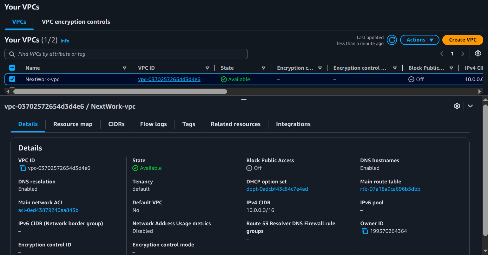

---

### Step 2 - Launch an EC2 Instance

Launched an Amazon EC2 instance inside the public subnet to communicate with Amazon S3.

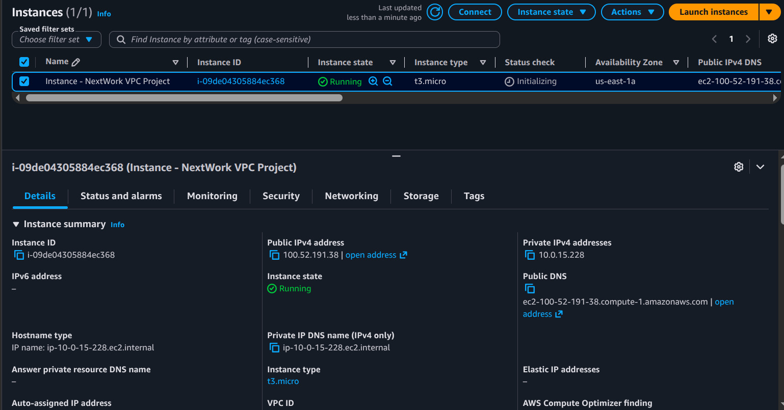

---

### Step 3 - Create an Amazon S3 Bucket

Created an Amazon S3 bucket and uploaded sample files for testing.

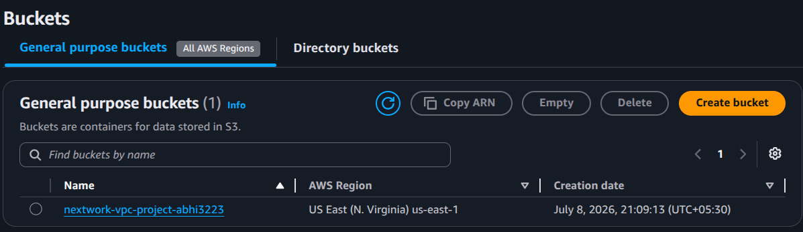

---

### Step 4 - Create a Gateway VPC Endpoint

Created an Amazon S3 Gateway VPC Endpoint to provide private connectivity between the VPC and Amazon S3.

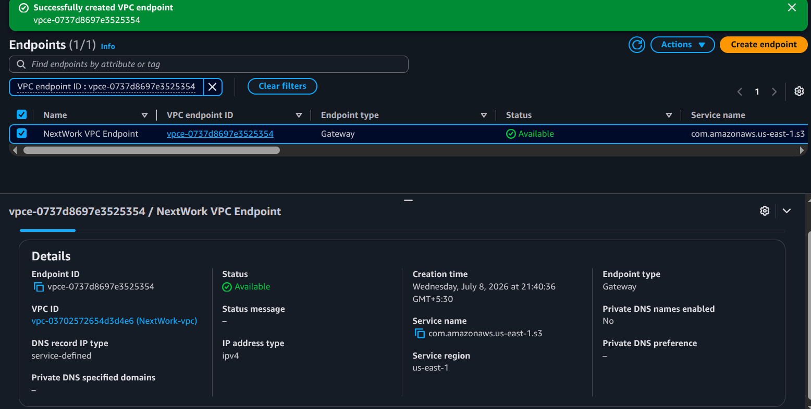

---

### Step 5 - Update the S3 Bucket Policy

Configured the bucket policy to allow requests only through the configured Gateway VPC Endpoint using the `aws:SourceVpce` condition.

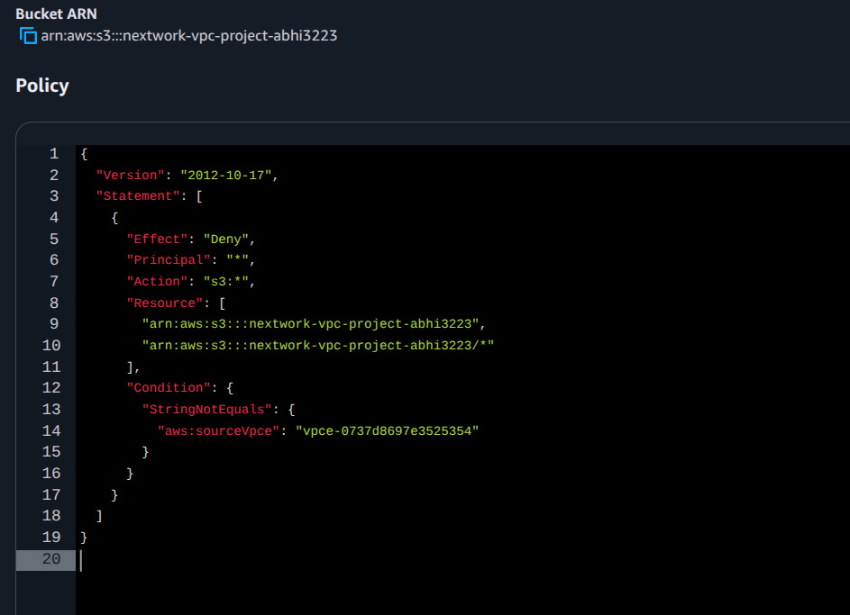

---

### Step 6 – Encountered an AccessDenied Error

After creating the Gateway VPC Endpoint, I updated the S3 bucket policy to allow access only through the configured VPC Endpoint.

When I tested the connection from my EC2 instance using the AWS CLI, the request failed with an **AccessDenied** error.

At first, I suspected the bucket policy, but after investigating the networking configuration, I found that the route table associated with my subnet did not contain the Amazon S3 Prefix List route pointing to the Gateway VPC Endpoint.

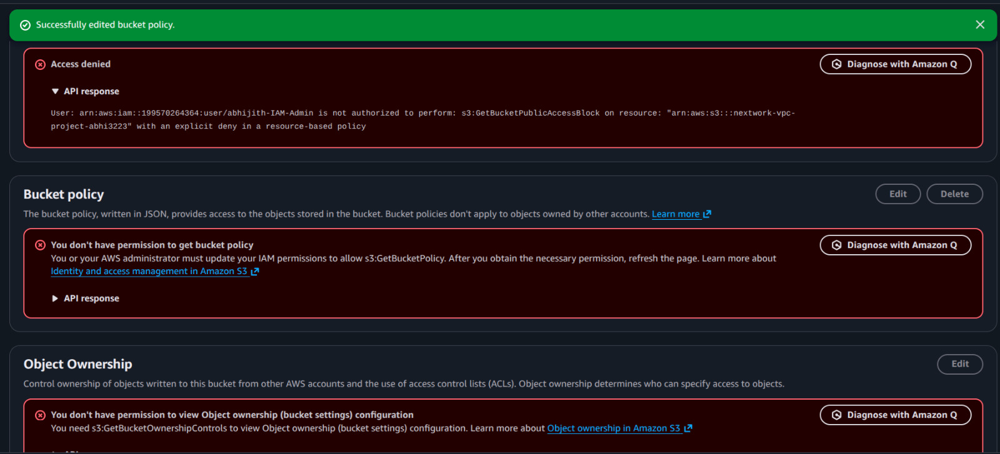

---

### Step 7 – Investigated the Route Table

To identify the cause of the AccessDenied error, I checked the subnet's route table.

I noticed that the Amazon S3 Prefix List route (`pl-...`) pointing to the Gateway VPC Endpoint was missing.

Without this route, traffic to Amazon S3 was not using the private endpoint, so the bucket policy denied the request.

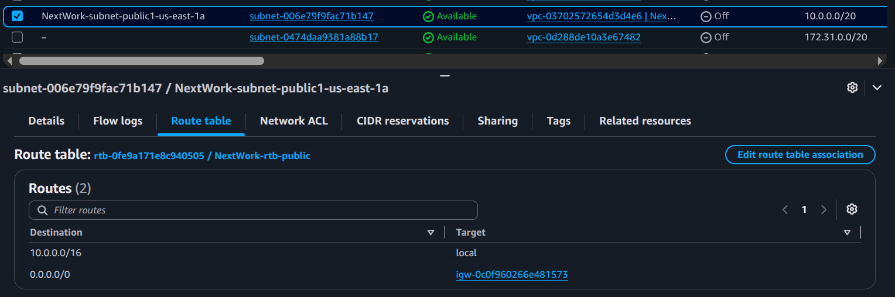

---

### Step 8 – Fixed the Routing Configuration

I modified the Gateway VPC Endpoint and associated it with the correct public route table.

After saving the changes, AWS automatically inserted the Amazon S3 Prefix List route into the route table.

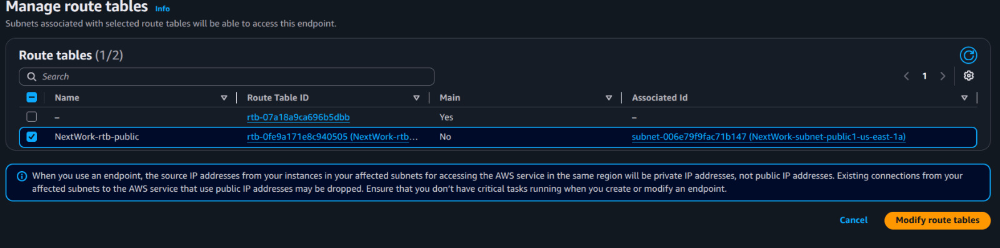

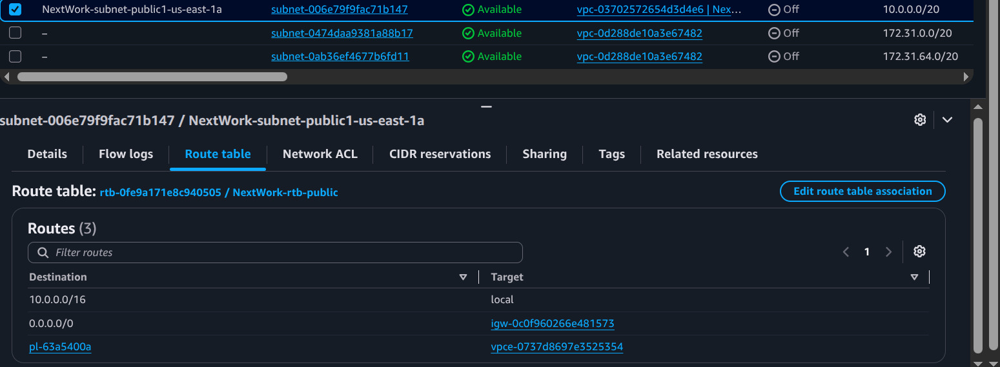

---

### Step 9 – Verified the Solution

After updating the route table, I tested the connection again.

The EC2 instance successfully listed the bucket contents and accessed Amazon S3 through the Gateway VPC Endpoint, confirming that traffic was now using the AWS private network.

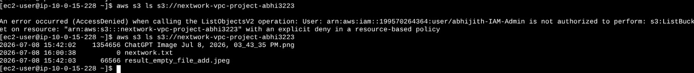

---

### Step 10 - Verify Secure Connectivity

Successfully accessed the Amazon S3 bucket from the EC2 instance after correcting the route table association.

---
